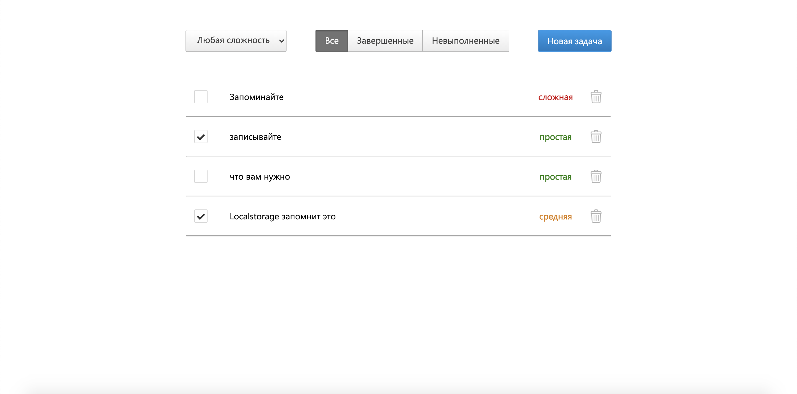

<h1 align="center">"Todo List"</h1>



# Описание
"Todo List" - это блокнот, в который можно записывать задачи и контролировать
их выполнение. В данном приложении можно ставить задачам ярлык сложности,
фильтровать задачи по уровню сложности, выполненные и невыполненные задачи.
Также здесь реализовано сохранение массива задач в *localstorage*, поэтому
вся информация будет сохранена в кэше браузера вашего устройства. 

# Стэк
Приложение создано с помощью create-react-app, используются:

- библиотека react;
- библиотека mobx;
- библиотека mobx-react;
- библиотека node-sass;
- таблицы стилей SCSS;

# Сборка проекта
```
npm install
npm start
```

# Лицензия
ISC